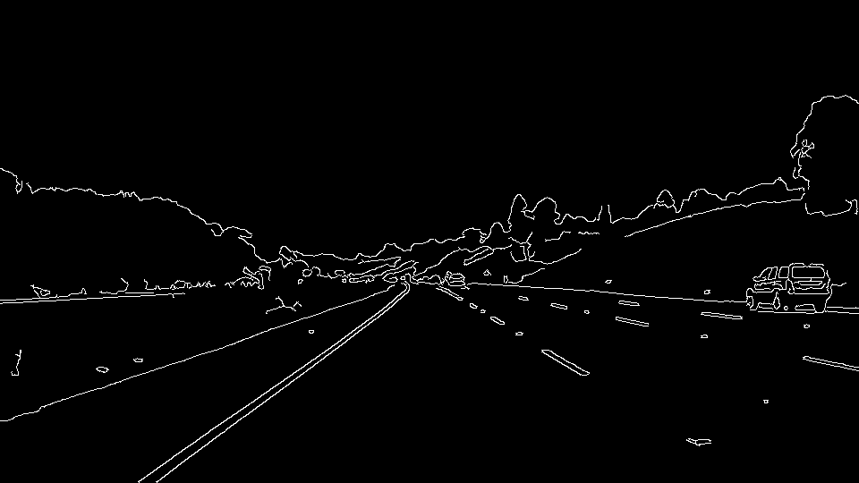

# **Finding Lane Lines on the Road** 

---

**Finding Lane Lines on the Road**

The goals / steps of this project are the following:

* Make a pipeline that finds lane lines on the road
* Reflect on your work in a written report

---

### Reflection

### 1. Describe your pipeline. As part of the description, explain how you modified the draw_lines() function.

< Initial Image >

My pipeline consisted of following steps.

First, I **converted the images to grayscale** since it is easier to detect the lines. However, to seperate the centerline and other lines in the lane, I would also need the information of the images with three or more color channels, but it was **not considered in this project**.

< Image with Grayscale > 

Then I detected the edges with **[Canny edge detector](https://en.wikipedia.org/wiki/Canny_edge_detector)** after **[Gaussian blurring](https://en.wikipedia.org/wiki/Gaussian_blur)** on grayscaled images to reduce the noise and smooth out the image.

< Canny Edge Detection > 

After that, I need to derive a line from the detected points through the **[Hough transform](https://en.wikipedia.org/wiki/Hough_transform)**. However, in order to detect only the lane, I applied the **region of interest** function so that a line can be drawn only from the points in the ROI by masking the image.

< Region of Interest >

< Hough Transform >

After detecting the desired lane, I could derive the resulting image by **weighted sum with the initial image**.

< After Line Detected Image >

In order to draw a single line on the left and right lanes, I modified the draw_lines() function by dividing the **right and left lines by the slope(either greater than zero, or less than zero)** and store the maximum and minimum values ​​of the x and y axis values ​​at that time. Then, I was able to **average/extrapolate** the line segments through np.polyfit.

< Draw a single line on the left and right lanes >

### 2. Identify potential shortcomings with your current pipeline

One potential shortcoming would be what would happen when the **camera is shaken**. since the **region of interest** function assumes that the car's camera is stationary, it is not easy to detect the lane if the camera is shaken.

Another shortcoming could be, as confirmed in the challenge video, it is not easy to detect lanes on days when the **sun is too bright** in the video.

### 3. Suggest possible improvements to your pipeline

In order to solve the problems mentioned above, rather than applying a hand-crafted algorithm such as the region of interest function, learning various frames by applying **Deep Learning** seems to be able to overcome the problems more stably.
